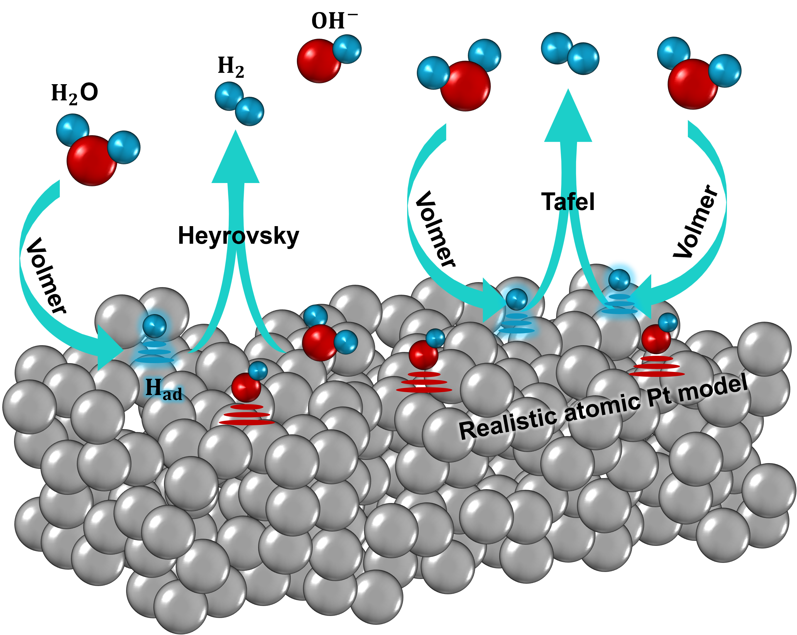

# Pt_HER_KMC
**Understanding HER (Hydrogen Evolution Reaction) kinetics under constant potential**

 The primary objective of this research is to investigate the reaction mechanism and kinetics of HER that supplies the hydrogen essential for the anode process in fuel cells, under constant potential conditions. To achieve this, I will calculate the activation barriers and free energies of various HER pathways using an implicit/explicit solvation environment-based density functional theory (DFT). Then, kinetic Monte Carlo (KMC) will be used to see detailed impacts on kinetics.

 

This study focuses primarily on well-defined crystalline platinum surfaces, such as Pt(111), Pt(100), and Pt(211). And then, it will examine structurally irregular surfaces, including grain boundaries, defects and amorphous Pt models. Additionally, Au surfaces will be used for comparative analysis when necessary.

Focusing on the representative HER pathway (Volmer, Tafel, and Heyrovsky mechanisms), I will evaluate the potential-dependent reaction barriers. In particular, the following pathways will be studied in detail:

* Volmer-Tafel mechanism (acid): 2Pt* + 2H+ + 2e- -> 2PtH -> 2Pt + H2
* Volmer-Heyrovsky mechanism (acid): Pt* + 2H+ + 2e- -> PtH + H+ + e- -> Pt + H2
* Volmer-Heyrovsky mechanism (alkaline): Pt* + 2H2O + M+ -> PtH + OH- + H2O + M+ -> Pt + H2 + 2OH- + M+

On top of this, surface reconstruction or leaching effect will be considered as well after calculating various barriers including: surface atom migration event or surface atom dissolved into the electrolyte phenomenon. Then, this research will establish fundamental design principles for optimizing HER using Pt electrode considering durability and detailed reaction mechanisms at constant potential condition.

